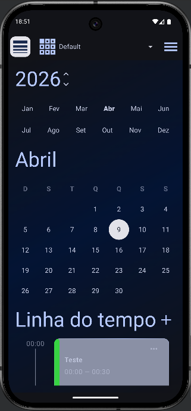
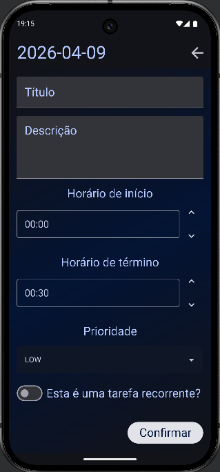
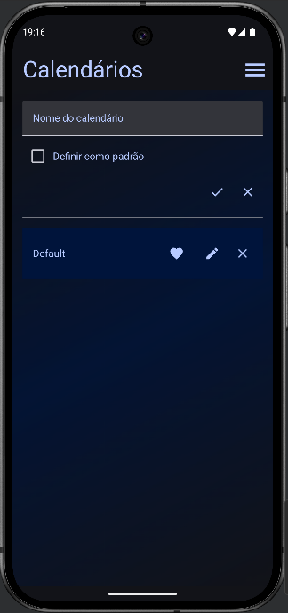
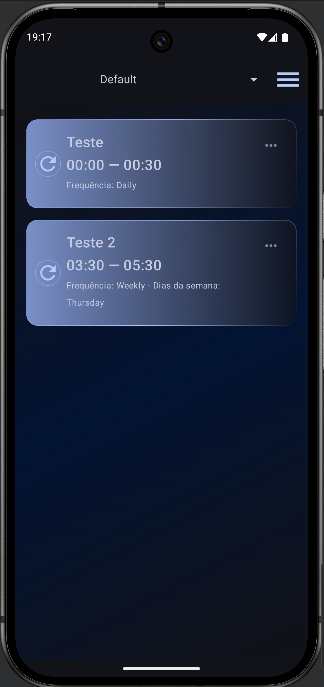
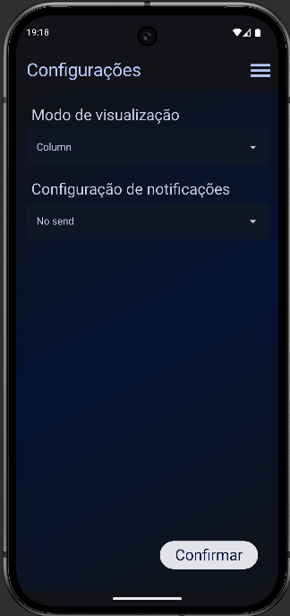

# Planning App

Planning App is a task and schedule management application designed to help users organize daily activities efficiently. It supports time-based scheduling and recurring tasks, focusing on scalability and clean data handling.

## Features

- Create, edit, and delete tasks

- Organize tasks by priority

- Define the recurrence of tasks.

- Simple and intuitive user interface

- Task visualization for better productivity

- Priority-based notification settings

- Translation based on smartphone settings for Portuguese, Spanish, and English.

# Screenshots







# Tech Stack

Language: Kotlin

Platform: Android

Database: SQLite 

## Project Structure

```
Planningapp
│
├── app/src/main/java/com/matheus/planningapp
│   ├── data
|   |   ├── calendar
|   |   ├── commitment
|   |   ├── recurrence
|   |   ├── local.converters
|   |   └── CalendarDatabase
│   ├── datastore
│   ├── di
│   ├── navigation
│   ├── ui
|   |   ├── screens
|   |   └── theme
│   ├── utils
│   ├── viewmodel
│   ├── MainActivity.kt
│   └── PlanningAppApplication.kt
└── README.md
```
- data: this package contains the files responsible for database configuration and the sub-packages for each table with entities, DAOs, and repository files.

- datastore: Store the files responsible for saving environment variables in local memory, used for simple settings such as display mode and task notification configuration.

- di: Abbreviation for dependency injection. This package contains the Koin configuration files for managing the creation of repository instances, viewmodels, and other classes.

- navigation: In this package, the application's navigation will be configured, defining the routes and parameters that need to be passed to each screen.

- ui: The abbreviation for User Interface, this package is responsible for the files that will assemble the interface that will communicate with the user. It is subdivided into 2 sub-packages: screens and theme.
  - screens: Contains all the project screens.

  - theme: Store the files that will manage the theme's colors and fonts.

- utils: Utility files as examples, notification components and converters.

- viewmodel: This package is subdivided into sub-packages based on the screens that contain the business logic, being responsible for communication with the data files and for the business logic itself.

- MainActivity.kt: Root file that instantiates the navigation and screens.

- PlanningAppApplication.kt: Root of the project responsible for creating the koin module instance and the data storage channel.

## Technologies Used

- Kotlin

- Jetpack Compose

- Android SDK

- Gradle

- Git

## License

This project is open-source and available under the MIT License.

## Author

Matheus\
Software Developer

GitHub:\
https://github.com/MatheusSC017